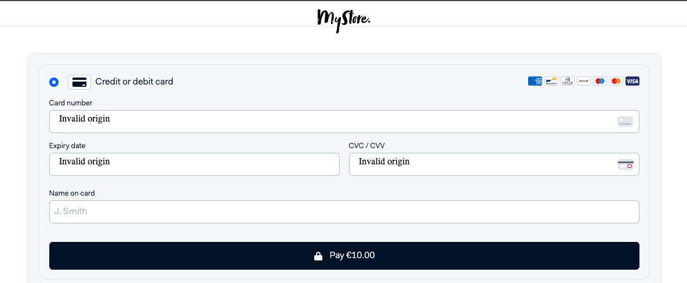

# Adyen [online payment](https://docs.adyen.com/checkout) integration demos

This repository includes examples of PCI-compliant UI integrations for online payments with Adyen. Within this demo app, you'll find a simplified version of an e-commerce website, complete with commented code to highlight key features and concepts of Adyen's API. Check out the underlying code to see how you can integrate Adyen to give your shoppers the option to pay with their preferred payment methods, all in a seamless checkout experience.


## Supported Integrations

**Node.js + Express** demos of the following client-side integrations are currently available in this repository:
 
- [Drop-in](https://docs.adyen.com/checkout/drop-in-web)
- [Component](https://docs.adyen.com/checkout/components-web)
  - ACH
  - Alipay
  - Boleto Bancário
  - Card (3DS2)
  - Dotpay
  - giropay
  - iDEAL
  - Klarna (Pay now, Pay later, Slice it)
  - SEPA Direct Debit
  - SOFORT

Each demo leverages Adyen's API Library for Node.js ([GitHub](https://github.com/Adyen/adyen-node-api-library) | [Docs](https://docs.adyen.com/development-resources/libraries#javascript)). See **./util/api.js** for API functions.

## Requirements

Node.js 16.0+

## (Pre-Session) Setup

1. Install Node v16 

(verify the installed version in your system by running `node -v` in your terminal)

2. Clone this repo:

```
git clone https://github.com/priyanka1409/lewagon-adyen-node.git
```

2. Navigate to the root directory and install dependencies:

```
npm install
```

## (Pre-Session) Usage


1. Start the server:

```
npm run dev
```

2. Visit [http://localhost:3000/](http://localhost:3000/) (**./views/index.handlebars**) to select an integration type.


## (In-Session) Exercises
#### 1. Keying It All In

   - From the home page (i.e. `http://localhost:3000`), select the Drop-in option.
   - Once you see a sample cart, try to checkout.
   - To resolve any errors faced, update your repository's `./.env` file with the `API_KEY`, `CLIENT_KEY` and `MERCHANT_ACCOUNT` key-value pairs (see our `Credentials` pdf).
   - Restart the server and try to checkout again.

#### 2. Origin(al) Problem

   - If you've made it so far, you should be seeing the following problem when trying to enter card details:
   
   - Let's think about what could be causing this. Once the required fix is applied, you should be able to input the card details.

#### 3. Make It Your Own

   - We want to see more of you in the transaction you make! Go through the code to see where you can add in your name for it to show up in the txn reference in our Customer Area.
   - Pass in the dummy card details (see our `Credentials` pdf) into the checkout UI in order to make a successful payment. We will verify your names in the Customer Area after.
   
###### *Voilà! You've successfully integrated with Adyen.*

## License

MIT license. For more information, see the **LICENSE** file in the root directory.
